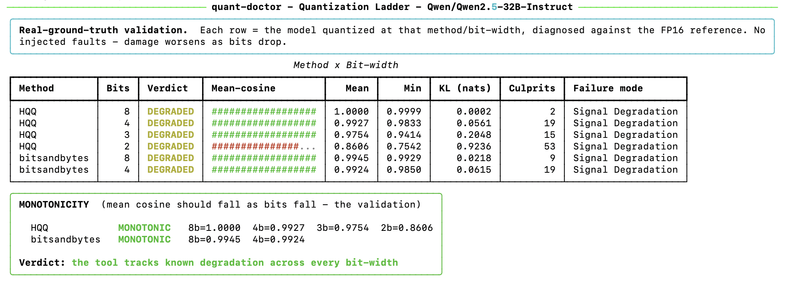
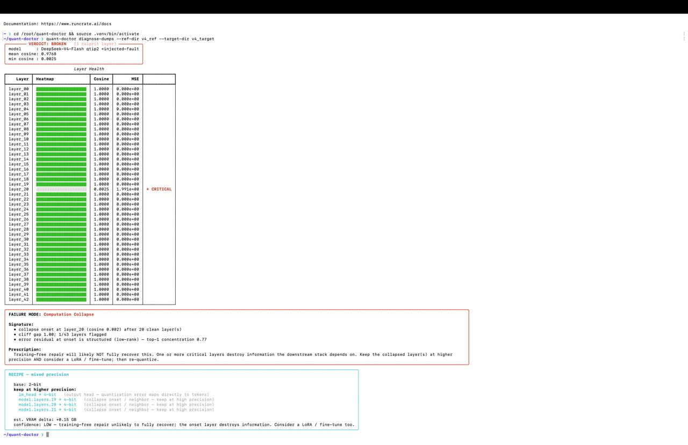

<div align="center">

# 🩺 quant-doctor

### The missing QA layer for quantized LLMs.

**You quantized a model. Is it still good? If not — *where* did it break, *why*, and *how* do you fix it?**
`quant-doctor` answers all four. No existing tool does.

</div>

---

Everyone ships **quantizers** — GPTQ, AWQ, bitsandbytes, QTIP, llama.cpp, dozens more.
Benchmarkers (LLMC, lm-eval) report *aggregate* quality — a perplexity number. But no shipped
tool combines **per-layer failure-mode classification** (why did it break) **+ a mixed-precision
prescription** (how to fix it) **+ MoE per-expert diagnostics** — the layer that tells you your
quantized model is silently broken *and where and why.*

The research community only *named* these failure modes in 2026
([*From Signal Degradation to Computation Collapse*](https://arxiv.org/abs/2604.19884), ACL 2026 Findings).
The taxonomy exists in a paper; this productizes it into a diagnostic.

> Built for the person **holding the quantizer** — fine-tuners, quantization researchers,
> infra teams — not the person downloading a pre-made quant. If you quantize your own
> model, you have no safety net. This is it.

---

## What it tells you

| Question | Answer it gives |
|----------|-----------------|
| **1. Is it broken?** | A verdict — `PASS` / `DEGRADED` / `BROKEN` — from perplexity-style KL divergence + per-layer cosine |
| **2. Where?** | A layer-by-layer damage heatmap, culprit layers flagged |
| **3. What *kind* of broken?** | **Signal Degradation** (cheap fix) vs **Computation Collapse** (needs retraining) vs **Format Bug** (your dequant is wrong) |
| **4. How do I fix it?** | A concrete mixed-precision recipe + its VRAM cost — *"keep lm_head + layers {11,12,13} at 16-bit"* |

---

## See it work

### The quantization ladder — real degradation, nothing injected

<p align="center">
  
</p>

This is the core validation: quantize **Qwen2.5-32B** at 8/4/3/2-bit (HQQ + bitsandbytes) and
measure each against the FP16 reference. As bits drop, **mean cosine falls (1.0000 → 0.86),
KL rises (0.0002 → 0.92), culprit count grows — monotonically, for both quantizers.** On a
real model, with real quantization, the tool tracks the *known* degradation with **no injected
faults.** Fully reproducible on any GPU that fits the model:

```bash
python scripts/quant_ladder.py --model Qwen/Qwen2.5-32B-Instruct
```

Raw data: [`docs/ladder-qwen2.5-32b.json`](docs/ladder-qwen2.5-32b.json).

**The finding it surfaces:** 3-bit holds ~97.5% fidelity; 2-bit drops to ~86% — a brutal cliff
for "one bit" (it's really a *third* of the bit budget). The tool measures that tradeoff on
*your* model instead of you guessing.

### How it localizes damage (controlled fault-injection test)

To validate the localization + failure-mode classification precisely, we inject a *known* fault
and confirm the tool finds it. Here layer 12 of a real quantized Qwen2.5-1.5B is deliberately
scrambled (`--inject-collapse 12`):

```console
$ quant-doctor diagnose --ref Qwen/Qwen2.5-1.5B --quantize bnb4 --inject-collapse 12

╭─ VERDICT: BROKEN  (16 culprit layers) ─╮   FAILURE MODE: Computation Collapse
│ model : Qwen/Qwen2.5-1.5B [bnb4]       │   • onset at layer_12 after 12 clean layers
│ mean cosine: 0.4854   min: -0.0407     │   • worst layer 20 — downstream fallout, not root
╰────────────────────────────────────────╯   • error at onset is structured (low-rank)
  layer_12 ░░░░░░░░░░  -0.0025  ← CRITICAL  (the injected fault)
  layer_13 ██░░░░░░░░   0.0937  ← CRITICAL  (real propagation through the network)
  layer_20 ░░░░░░░░░░  -0.0407  ← CRITICAL  (downstream fallout)
```

⚠️ **This is a controlled test** — the fault is *injected* so we know ground truth. What it
proves is the *localization*: it names the **onset** (layer 12) as the root cause and layer 20
as downstream fallout, via the structured-vs-diffuse error signature. Real error propagation,
deliberately planted fault.

### Scaling to frontier models — a private-stack case study

<p align="center">
  
</p>

quant-doctor also runs on **real DeepSeek-V4-Flash activations** (236B MoE, 43 layers, 2-bit
QTIP), captured from **Arc — a custom Rust inference engine.** ⚠️ **Not publicly reproducible**
(needs Arc), so treat this as a *private-stack case study*, not a public demo. The fault shown
is again **injected** (layer 20) — it proves the pipeline handles frontier-scale tensors, not
that it caught a natural V4 defect. A *natural* V4 quant diagnosis needs a full-precision 236B
reference that doesn't fit on one GPU — genuine future work. Honest limitations:
[`docs/validation.md`](docs/validation.md).

---

## Quickstart

```bash
git clone https://github.com/asmit383/LLM-Doc.git && cd LLM-Doc
pip install -e ".[dev]"
pip install bitsandbytes        # or your quantization backend of choice
```

```bash
# Self-quantizer flow — you have one FP model, quantize it yourself, check your work
quant-doctor diagnose --ref Qwen/Qwen2.5-1.5B --quantize bnb4

# Compare against a checkpoint you already quantized (GPTQ/AWQ/…)
quant-doctor diagnose --ref meta-llama/Llama-3-8B --target ./llama-3-8b-gptq-2bit --quantize none

# Custom / huge / MoE stacks (QTIP, Arc, 200B+ models) — diagnose from activation dumps
quant-doctor diagnose-dumps --ref-dir activations_ref/ --target-dir activations_quant/
```

---

## How it works

```
  ref model ─┐                                                    ┌─ verdict
             ├─▶ capture ─▶ metrics ─▶ classify ─▶ recipe ─▶ report┤─ heatmap
  quant model┘   (paired    (cosine    (failure    (mixed-        └─ failure mode
                activations)  KL, MSE,   mode)       precision)      + prescription
                             subspace)
```

The engine operates on **paired activations** — the same input run through both models,
compared layer by layer. This one design choice makes it **format-agnostic**: whether the
activations come from live HF forward-hooks or `.safetensors` dumps written by a custom
Rust stack, the metrics, classifier, and recipe code are identical.

- **Sequential capture** → peak memory is `max(ref, quant)`, never the sum, so a single
  GPU can diagnose a model whose fp + quant copies wouldn't co-reside.
- **No FP16 reference needed** → compares whatever you *have* (e.g. FP4 weights) against the
  quantized output. Right for 236B MoE models that have no full-precision checkpoint.

### The failure modes

| | **Signal Degradation** | **Computation Collapse** | **Format Bug** |
|---|---|---|---|
| What broke | precision (noise) | function (a critical layer) | the decoder itself |
| Shape | gradual decline with depth | sharp cliff after a clean prefix | uniform, from layer 0 |
| Error | diffuse (high-rank) | structured (low-rank) | total |
| Fix | keep a few layers higher-bit — **cheap** | fine-tune / reconstruct — **expensive** | fix dequant, *not* bits |
| Typical | 4-bit | 2-bit | e.g. MXFP4-as-INT4 |

Telling these apart *before* you spend hours on the wrong fix is the entire point.

---

## Validation

Three layers of evidence, honestly separated (real vs injected):

1. **Real quantization ladder — the keystone, nothing injected.** Qwen2.5-32B across HQQ
   8/4/3/2 + bitsandbytes 8/4 vs FP16; both quantizers track the *known* monotonic degradation
   (shown above). Real model, real quantization, no planted faults. Fully reproducible.
2. **Synthetic ground-truth (`pytest`, 38 tests).** Controlled injected damage with known
   labels — the classifier must recover the right failure mode + culprit layer/expert.
3. **Fault-localization on real activations.** Inject a *known* fault into a real quantized
   model (Qwen2.5 live, and DeepSeek-V4-Flash via the private Arc stack) and confirm the tool
   localizes it. Proves localization on real tensors — the fault is injected, not natural.

```bash
pytest        # 38 passed
```

See [`docs/validation.md`](docs/validation.md) for all case studies and the honest limitations —
including that the V4 case is a private-stack study with an injected fault, and that
cross-architecture calibration breadth is still growing.

---

## Project layout

```
src/quant_doctor/
├── cli.py            # Typer CLI: diagnose, diagnose-dumps
├── loader.py         # sequential HF load + self-quantize (bnb 4/8-bit)
├── capture.py        # forward-hook activation capture (+ fault injection)
├── dumps.py          # load/validate activation dumps (custom stacks)
├── engine.py         # diagnose_pair() — the format-agnostic core
├── classifier.py     # rule-based failure-mode decision tree
├── recipe.py         # mixed-precision recipe generation
├── report.py         # rich CLI heatmap + panels
├── synthetic.py      # ground-truth bug-injection oracle
└── metrics/          # statistical · interpretability · propagation
docs/
├── dump-format.md    # the activation-dump contract
└── validation.md     # methodology + results
```

System design in [`quant-doctor-flowchart.md`](quant-doctor-flowchart.md).

---

## Why it's defensible

- **The gap is specific and real** — quantizers apply quantization; benchmarkers (LLMC, lm-eval)
  report aggregate quality. The uncontested niche is the *combination*: per-layer failure-mode
  classification **+** a mixed-precision prescription **+** MoE per-expert diagnostics.
- **The moat is calibration, not code** — a weekend wrapper can compute cosine similarity.
  The durable value is calibrated thresholds and per-architecture failure signatures. *(Honest
  status: calibration is validated on a real 32B ladder + synthetic ground truth today;
  broadening across architectures/quantizers is active work — see the roadmap.)*
- **The engine is format-agnostic** — one diagnostic core serves GPTQ, AWQ, bitsandbytes,
  and custom trellis quantizers (QTIP) alike, from live hooks or activation dumps.

## Non-goals

Not a quantizer (we diagnose; existing tools quantize) · not a fine-tune validator
(divergence there is *intended* — the logic inverts) · not a dashboard/SaaS · not
"any model, any quant" — scoped to transformer-family models and hookable formats.

## License

MIT
